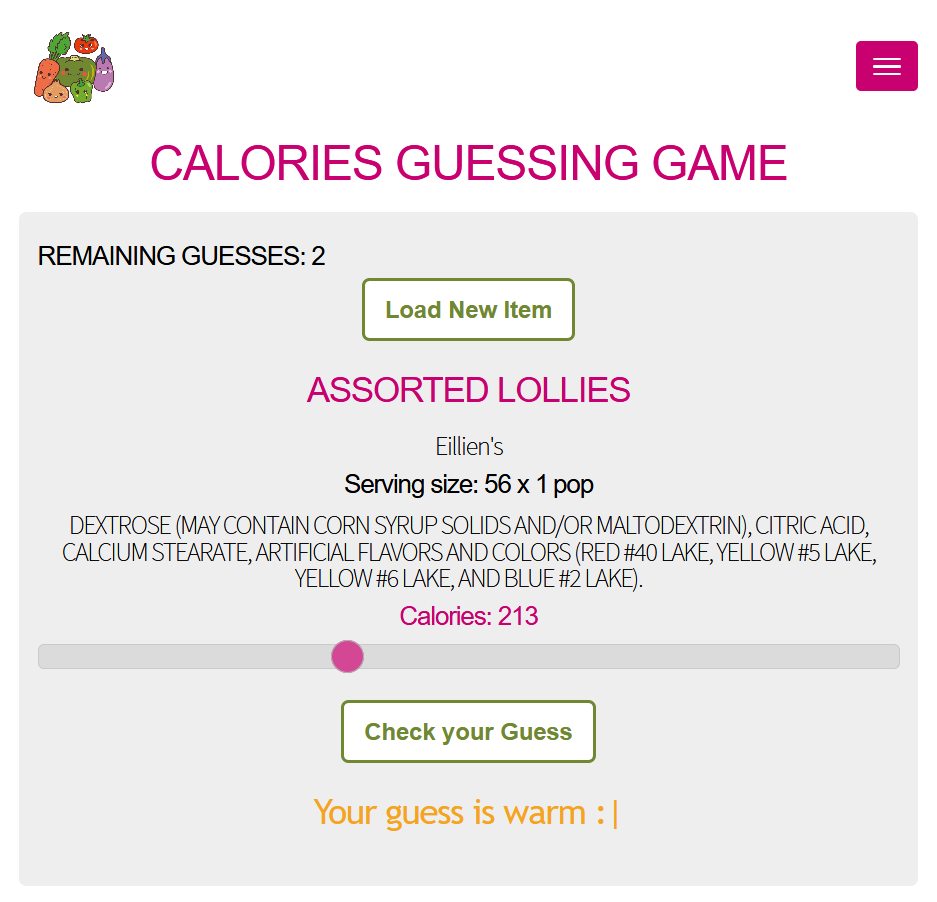
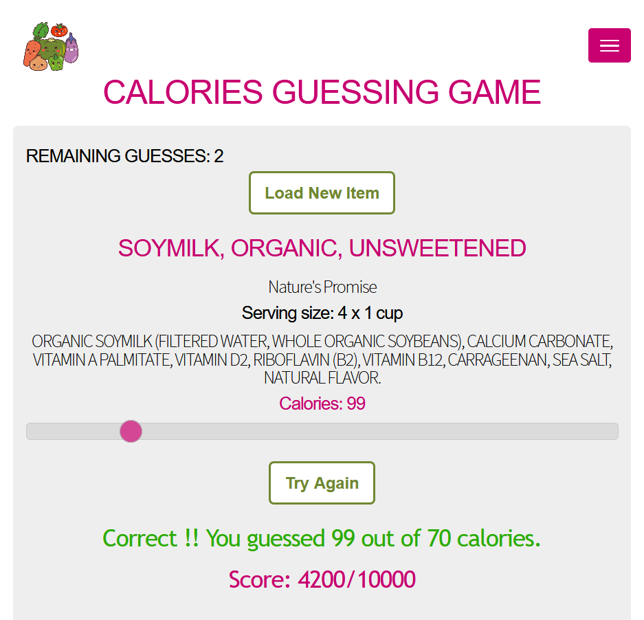
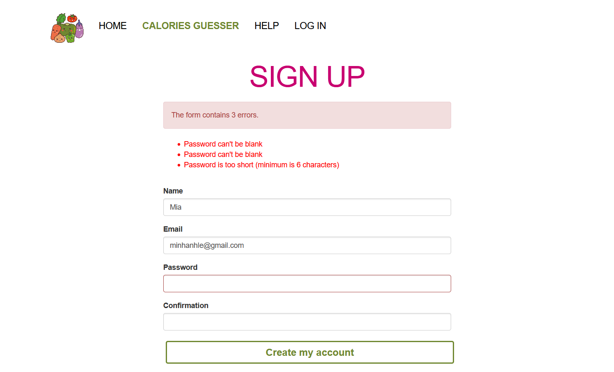
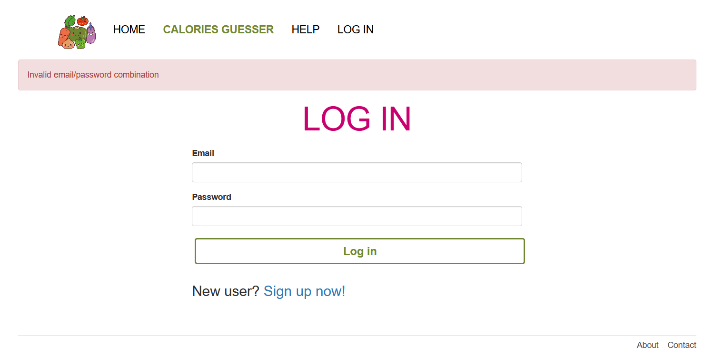
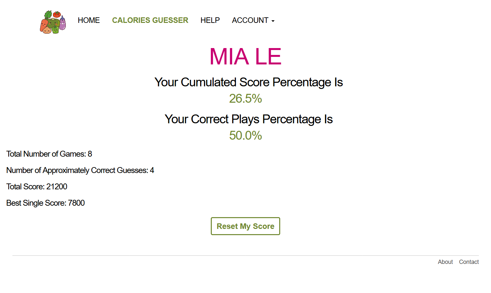

**[Kalory](https://calories-guessing-game.herokuapp.com/)** is a _CRUD_ website using **Ruby on Rails**, created to gamify nutrition planning. The user can hone their calories estimation skills through a guessing game with multiple examples of popular groceries items.

The game uses data from the [Nutritionx API](https://www.nutritionix.com/database) to provide users with example of common grocery items. The user can guess the correct calories per serving based on detailed description of ingredients. An _interactive slider_ is used to input _upto 5 guesses_. There will be messages based on the _"cold - warm - hot" system_ to indicate how close the guess was from the correct answer. Once the guess is close enough to the actual answer, a _score_ will be calculated based on how close the guess is.

  

  

The website allows guests to play the game, but there is also an option to create accounts. The Sign Up/ Log In process is made as straight foward as possible by _descriptive error messages_.

  

 
  

Once the user log into their account, they can track their _game stats_ and therefore track their nutrition planning skills.

 
  

